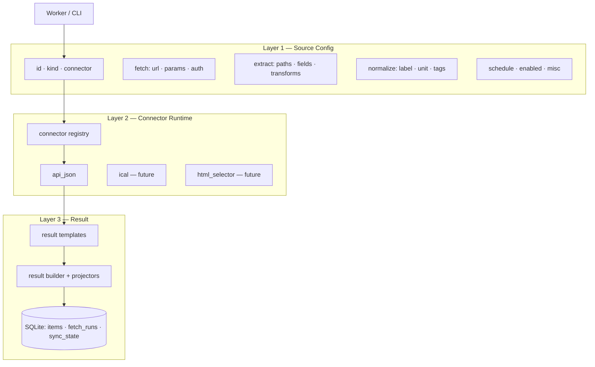

# Ingestion Spec

**Project:** Athena ingestion layer — config-driven pipeline that fetches structured facts from external sources and stores normalized results for the planning agent and dashboard.
**Status:** draft
**Last updated:** 2026-07-15

## Goal

Build a deterministic ingestion pipeline with three clearly separated layers: **source config** (what to fetch and how to interpret it), **connectors** (reusable fetch+extract handlers), and **result** (a thin storage envelope plus **result templates** that shape payload, agent context, and dashboard bindings). Start with the `api_json` connector; add `ical`, `html_selector`, and others later without changing the storage envelope or worker loop.

Ingestion runs on a schedule or via CLI (`athena fetch`). It does not use an LLM. The agent and dashboard read the result store — they never call external APIs directly.

## Success criteria

- A YAML (or JSON) source config fully describes a JSON API source: URL, request parameters, auth, field extraction, labeling, and schedule.
- The `api_json` connector fetches and extracts from at least two real APIs (e.g. Open-Meteo + one authenticated API) using only config — no per-source Python.
- Every successful run produces one or more **result records** upserted into SQLite with stable `source_id` + `record_id` keys, shaped by a declared result template.
- Agent and dashboard consume **projections** from templates (`agent.fields`, `dashboard.bindings`) — not hard-coded per-`kind` handlers.
- Failed runs are isolated per source; `fetch_runs` records success/failure without blocking other sources.
- Manual `athena fetch --source <id>` and scheduled runs share the same code path.
- Adding a future connector type requires implementing one handler registered by name — existing configs and results unchanged.

## Constraints

- Personal scale: 2–10 sources initially, polling every few minutes to daily.
- Python worker, SQLite storage, APScheduler or system cron (no Celery/Temporal in v1).
- APIs preferred over scraping; `api_json` is the first connector.
- Secrets via environment variable substitution (`${VAR}`) — never commit API keys to config files.
- Result templates declare how the same stored payload is projected for agent vs. dashboard; new data shapes start as YAML, not Python.
- Align with system architecture in `.cursor/architecture-overview.html` and research in `ingestion/.cursor/ingestion-research.md`.

## Architecture overview

Ingestion is a **config → connector → result** pipeline. Each layer has a single responsibility; layers connect through well-defined interfaces, not shared logic.



### Layer boundaries

| Layer | Owns | Does not own |
|-------|------|--------------|
| **Source config** | Per-source declarative rules: what URL to call, which params, which response fields to keep, which result template to apply, when to run | HTTP client code, JSON parsing implementation, SQL |
| **Connector** | Reusable fetch+extract logic for a *class* of sources (`api_json`, `ical`, …) | Per-site URLs, per-site field mappings (those live in config), result shaping |
| **Result** | Result templates, thin storage envelope, agent/dashboard projections, dedup, audit log | How raw bytes are obtained or parsed |

### Key decisions

| Decision | Choice | Rationale |
|----------|--------|-----------|
| Config format | YAML files in a source registry directory | Human-editable, matches research and architecture docs; DB mirror optional later |
| First connector | `api_json` | Most target sources (weather, stocks, task/calendar APIs) expose JSON; validates the 3-layer split cleanly |
| Result contract | Thin storage envelope + **result templates** | Fixed `kind` + `value` shapes force agent/dashboard code changes per data type; templates mirror the connector pattern — declare shape and projections in YAML |
| Result template format | YAML files in `results/` registry (v1: code-like); inline overrides in source config | Reusable across sources; evolves toward UI form in later phases without changing storage |
| Auth | `${ENV_VAR}` substitution in config at runtime | Keeps secrets out of repo; simple for personal single-user setup |
| Identity / dedup | `source_id` + `record_id` (+ optional `content_hash`) | `record_id` derived from template `storage.record_id` expression |
| Orchestration | Per-source try/except in one worker process | Sufficient at 2–10 sources; matches architecture overview |
| Scheduling | Per-source cron in config | Calendar every 5m, weather daily — not one global interval |

## The three layers (detailed)

### Layer 1 — Source config

One config file (or DB row) per external source. The config is the **only** place that varies per site. Structure:

```yaml
id: nyc-weather                    # unique source identifier
connector: api_json                # which handler runs this source
result: forecast_card              # result template (results/forecast_card.yaml)
enabled: true

fetch:
  url: "https://api.open-meteo.com/v1/forecast"
  method: GET                      # default GET
  params:                          # query string or body parameters
    latitude: 40.71
    longitude: -74.01
    daily: "temperature_2m_max,precipitation_probability_max"
    timezone: America/New_York
  headers: {}                      # optional; auth often goes here
  # body: {}                       # for POST/PATCH when needed

auth:
  # Optional. Secrets resolved from environment at runtime.
  type: bearer | api_key_query | api_key_header | basic | none
  secret_env: OPEN_METEO_KEY       # env var name; value injected per auth.type
  # api_key_param: apikey          # when type is api_key_query
  # header_name: Authorization     # when type is bearer or api_key_header

extract:
  # How to pull structured values from the JSON response.
  mode: single | items             # single = one record; items = array at items_path
  items_path: "$.daily"            # JSONPath to array (mode: items) or object (mode: single)
  fields:                          # map of output field name → JSONPath (relative to each item)
    high: "$.temperature_2m_max[0]"
    rain_pct: "$.precipitation_probability_max[0]"
    date: "$.time[0]"
  transforms:                      # optional per-field transform pipeline
    high: [{ op: float }]
    rain_pct: [{ op: int }]
  # sync:                          # optional incremental fetch state
  #   cursor_path: "$.nextPageToken"
  #   store_as: next_page_token

result_overrides:                  # optional per-source overrides (see result templates)
  payload:
    label: "NYC today"
  agent:
    summary: "NYC forecast: high {high}°F, {rain_pct}% rain"

schedule:
  cron: "0 6 * * *"                # per-source cron expression
  timezone: America/New_York

meta:
  description: "Open-Meteo daily forecast for NYC"
  origin: api                      # api | scrape — operational metadata
  tags: [weather, daily]           # optional filters for dashboard / agent queries
```

**Config responsibilities:**

- **fetch** — URL, HTTP method, query/body parameters, headers. Supports `${ENV_VAR}` in any string value for API keys and tokens.
- **auth** — Declarative auth pattern; connector applies it to the request. Config never holds literal secrets.
- **extract** — Which parts of the JSON response to return: JSONPath expressions, single vs. list mode, optional transforms (cast, round, date parse).
- **result** — Name of a result template that maps extract output → stored payload + agent/dashboard projections. Optional `result_overrides` patch the template for this source only.
- **schedule / meta** — Cron, timezone, enabled flag, description, tags.

The config does **not** embed Python or connector implementation details beyond the `connector` type name.

### Layer 2 — Connectors

A connector is a **registered handler** keyed by name (`api_json`, `ical`, …). It implements a fixed interface:

```
run(source_config) → list[ExtractedItem]
```

`ExtractedItem` is a plain dict produced by `extract` — field names match `config.extract.fields` keys. Connectors do **not** apply result templates.

Internally, `api_json` performs two steps (the worker may call these separately for logging/testing):

1. **fetch** — Build HTTP request from `config.fetch` + `config.auth`; execute; return raw response (status, headers, body bytes).
2. **extract** — Parse JSON; apply `config.extract` JSONPath rules and transforms; produce `list[dict]`.

**Connector registry** — Map string → handler. Worker resolves `config.connector` at runtime. Adding `ical` later = new handler class + registry entry; zero changes to result templates or storage envelope.

**`api_json` connector (v1 scope):**

| Step | Input | Output |
|------|-------|--------|
| fetch | `fetch.*`, `auth.*` | `RawResponse` (status, json body) |
| extract | `extract.*`, JSON body | `list[dict]` of extracted field values |

**Future connectors** (out of v1 scope, same interface):

| Connector | Fetch | Extract |
|-----------|-------|---------|
| `ical` | GET `.ics` URL | Parse VEVENT fields per `extract.fields` |
| `html_selector` | GET HTML page | CSS selector + attr per `extract` |
| `html_table` | GET HTML page | Table rows → dicts via `column_map` |
| `rss` | GET feed XML | Map item fields |
| `browser` | Playwright navigate | Reuse `html_selector` extract rules |

### Layer 3 — Result

The result layer has two parts: a **thin storage envelope** (stable across all sources) and **result templates** (flexible, config-driven, parallel to connectors).

#### Why not a fixed DataPoint?

A unified `DataPoint` with a `kind` enum and free-form `value` dict looks simple but couples agent and dashboard to a fixed type system. Every new shape (e.g. task with subtasks, esports match with stream URL, stock with pre-market flag) either gets squeezed into an existing `kind` or requires Python changes in downstream consumers.

Result templates invert this: **storage stays generic; semantics live in config.**

| Fixed DataPoint | Result templates |
|-----------------|------------------|
| `kind` enum selects widget + agent parsing | `result.template` selects a YAML template with explicit projections |
| `value` shape implied by `kind` | `payload` shape declared in template `schema` |
| New type → code in agent + dashboard | New type → YAML file (+ optional generic widget fallback) |
| `label`, `unit` on envelope | Declared in template `payload` / `dashboard.bindings` |

#### Thin storage envelope

Every stored record uses the same shape regardless of source or template:

```json
{
  "source_id": "todoist-inbox",
  "result_template": "task_item",
  "record_id": "8234234234",
  "payload": {
    "title": "Review PR",
    "due": "2026-07-15",
    "priority": 3
  },
  "as_of": "2026-07-14T10:00:00Z",
  "meta": {
    "content_hash": "abc123…",
    "fetch_run_id": "…"
  }
}
```

- `payload` — arbitrary JSON, validated against the template's `schema` section.
- `result_template` — which YAML template produced this record; drives projection.
- `record_id` — dedup key, derived from template `storage.record_id` expression (e.g. `"{external_id}"`).

Agent and dashboard **never parse `payload` ad hoc**. They call projectors that read the template's `agent` and `dashboard` sections.

#### Result templates (v1: code-like YAML)

Templates live in `results/<name>.yaml`, loaded by a **result template registry** (parallel to connector registry). A source config references one by name: `result: task_item`.

```yaml
# results/task_item.yaml
id: task_item
version: 1

schema:
  # Declares expected payload fields. Validated at write time.
  title:     { type: string, required: true }
  due:       { type: datetime, optional: true }
  priority:  { type: integer, default: 0 }
  completed: { type: boolean, default: false }

map:
  # Maps extract field names → payload field names.
  # Keys match config.extract.fields output; values are payload keys.
  title:     title
  due:       due
  priority:  priority
  completed: completed

storage:
  record_id: "{external_id}"                    # interpolated from extract/map
  content_hash_fields: [title, due, priority, completed]

agent:
  fields: [title, due, priority]              # subset of payload sent to planning agent
  summary: "{title} (due {due}, P{priority})" # optional context string template

dashboard:
  widget: task_row                            # registered widget name
  bindings:
    primary: title
    secondary: due
    badge: priority
```

```yaml
# results/forecast_card.yaml
id: forecast_card
version: 1

schema:
  label:     { type: string, required: true }
  high:      { type: number }
  rain_pct:  { type: integer }
  unit:      { type: string, default: imperial }

map:
  label:     label      # from result_overrides.payload.label or static default
  high:      high
  rain_pct:  rain_pct
  unit:      unit

storage:
  record_id: "{date}"
  content_hash_fields: [high, rain_pct]

agent:
  fields: [label, high, rain_pct, unit]
  summary: "{label}: high {high}, {rain_pct}% rain"

dashboard:
  widget: forecast_card
  bindings:
    title: label
    high: high
    rain_pct: rain_pct
```

**Per-source overrides** — source config `result_overrides` deep-merges onto the template so one template serves many sources with different labels or agent summaries without forking the template file.

#### Result runtime

```
render(extracted_items, template, overrides) → list[ResultRecord]
project_for_agent(record, template) → dict | str
project_for_dashboard(record, template) → { widget, props }
```

| Component | Role | New type cost |
|-----------|------|---------------|
| Template registry | Load `results/*.yaml` | — |
| Result builder | Apply `map`, validate `schema`, compute `record_id` + `content_hash` | — |
| Projectors | Read `agent.*` / `dashboard.*` from template | — |
| Dashboard widget | Render `widget` name | One UI component per *widget*, not per source |
| Built-in templates | Ship `scalar`, `forecast_card`, `task_item`, `schedule_event` | YAML only |

**Adding a new result type (v1):**

1. Add `results/my_type.yaml` with schema, map, agent, dashboard sections.
2. Set `result: my_type` in source config.
3. If `dashboard.widget` is unknown, fall back to `generic_json` widget (shows payload as formatted JSON).
4. Agent works immediately via `agent.fields` / `agent.summary` — no code change.

**When Python IS still needed:** new dashboard *widget* component (e.g. a sparkline chart), new `schema` field type, or new transform op. Not per source and not per payload shape.

#### Evolution path (config → user-friendly)

| Phase | Format | Audience |
|-------|--------|----------|
| v1 (now) | YAML templates in `results/`, inline `result_overrides` | Developer / agent author |
| v2 | Category wizards pre-fill templates ("add task API" → `task_item` defaults) | Power user |
| v3 | Visual template editor writes same YAML/JSON schema | General user |

The storage envelope and projector interface stay stable across all phases.

#### Built-in templates (ship with v1)

| Template | Use case | Agent needs | Dashboard widget |
|----------|----------|-------------|------------------|
| `scalar` | Stock quote, single stat | `summary` | `stat_card` |
| `forecast_card` | Weather | `summary` | `forecast_card` |
| `task_item` | Todoist, Linear tasks | `fields` + `summary` | `task_row` |
| `schedule_event` | Calendar, esports | `fields` + `summary` | `schedule_row` |
| `generic_json` | Fallback / exploration | all payload keys | `generic_json` |

**Persistence (SQLite):**

| Table | Purpose |
|-------|---------|
| `sources` | Config metadata mirror: id, connector, result template, schedule, enabled, last_status, last_run_at |
| `items` | Latest result records (upsert by `source_id` + `record_id`); `payload` as JSON column |
| `fetch_runs` | Per-run audit: source_id, started_at, duration_ms, status, error, item_count |
| `sync_state` | Optional cursors / sync tokens for incremental APIs (`updated_since`, page tokens) |

**Upsert rules:**

- Match on `(source_id, record_id)`; update `payload`, `as_of`, `content_hash` if changed.
- If `content_hash` unchanged, skip write (optional optimization).
- On fetch failure: log to `fetch_runs`, update `sources.last_status = error`, do not delete existing items.

## End-to-end flow

```
scheduler tick OR `athena fetch --source X`
  → load source config + result template from registries
  → skip if disabled or not due (scheduler only)
  → connector = registry[config.connector]
  → extracted = connector.run(config)
  → records = result.render(extracted, template, config.result_overrides)
  → store.upsert(records)
  → store.log_fetch_run(success)
  → store.advance_sync_state(config)   # if incremental config present
```

Downstream reads:

```
agent.plan()  → store.query(sources) → project_for_agent(record, template) per item
dashboard     → store.query(sources) → project_for_dashboard(record, template) per item
```

On failure: catch per source, `store.log_fetch_run(error)`, continue to next source.

## Steps

### Step 1: Result model, templates, and storage

**ID:** `ingest-step-1`
**Goal:** Thin result record type, result template registry, built-in templates, SQLite schema, and upsert exist.
**Scope:**
- In: `ResultRecord` envelope, `results/*.yaml` loader, result builder (`map` + `schema` validate), `project_for_agent` / `project_for_dashboard`, `items` / `fetch_runs` / `sources` / `sync_state` tables, upsert helper, ship `scalar`, `forecast_card`, `task_item`, `schedule_event`, `generic_json` templates
- Out: Connectors, scheduler, source config loader
**Depends on:** none

**Deferred decisions:**
- ORM vs raw SQL vs sqlite3
- JSON Schema vs lightweight custom validation for `schema` section
- History retention: overwrite only vs append time-series

---

### Step 2: Source config schema and registry

**ID:** `ingest-step-2`
**Goal:** YAML source files validate against a schema and load into a registry the worker can iterate.
**Scope:**
- In: Config schema (fetch, auth, extract, `result` + `result_overrides`, schedule), `${ENV_VAR}` resolution, `sources/` directory convention, enabled/disabled filtering, validation that `result` references an existing template
- Out: UI for editing configs, DB-backed registry
**Depends on:** `ingest-step-1` (template names must resolve)

**Deferred decisions:**
- Pydantic vs dataclasses vs manual validation
- Single `sources.yaml` vs one file per source
- JSON Schema export for future onboarding UI

---

### Step 3: `api_json` connector

**ID:** `ingest-step-3`
**Goal:** `api_json` connector implements `run(config) → list[dict]` for `mode: single` and `mode: items`.
**Scope:**
- In: HTTP fetch (GET/POST), auth types (bearer, api_key_query, api_key_header), JSONPath extract, transform ops (float, int, str, date)
- Out: Other connector types, LLM extract, Playwright; result rendering (handled by step 1 builder, wired in step 4)
**Depends on:** `ingest-step-2`

**Deferred decisions:**
- HTTP library (httpx vs requests)
- JSONPath library
- Transform DSL extensibility
- Rate limiting / retry policy per source

---

### Step 4: Worker and CLI

**ID:** `ingest-step-4`
**Goal:** `athena fetch` runs one or all enabled sources through the full extract → render → store pipeline; per-source errors are isolated and logged.
**Scope:**
- In: Fetch loop, wire connector output through `result.render()`, `fetch_runs` logging, `sources.last_status` updates, `athena fetch --source <id>` and `athena fetch --all`
- Out: APScheduler integration
**Depends on:** `ingest-step-1`, `ingest-step-2`, `ingest-step-3`

**Deferred decisions:**
- CLI framework (click vs argparse vs typer)
- Exit codes on partial failure
- Structured logging format

---

### Step 5: Scheduler

**ID:** `ingest-step-5`
**Goal:** Enabled sources run automatically on their configured cron without manual invocation.
**Scope:**
- In: APScheduler (or cron calling CLI), per-source cron from config, timezone handling, skip-if-not-due
- Out: Distributed queue, webhook triggers
**Depends on:** `ingest-step-4`

**Deferred decisions:**
- APScheduler in-process vs system crontab
- Overlap policy if a fetch is still running when the next tick fires

---

### Step 6: Second connector + real sources

**ID:** `ingest-step-6`
**Goal:** At least two live JSON API sources and one additional connector type (likely `ical`) prove the architecture extends without storage envelope changes — only new templates and configs.
**Scope:**
- In: Wire real configs (e.g. Open-Meteo + Todoist/Google Calendar or similar), implement `ical` connector
- Out: html_selector, browser, onboarding UI
**Depends on:** `ingest-step-5`

**Deferred decisions:**
- Which two APIs to ship as reference configs
- `ical` field mapping vs dedicated `schedule` kind handling

## Open questions

- **Historical depth:** Overwrite latest value only, or append each fetch as a time-series row for charts?
- **Reference sources:** Which 2–3 real APIs to ship as examples (Open-Meteo confirmed; stock/task/calendar TBD)?
- **Incremental sync:** Which first-class APIs need `sync_state` / `updated_since` in v1?
- **Config location:** `ingestion/sources/*.yaml` vs repo-root `sources/`?
- **Template strictness:** Reject writes that fail `schema` validation, or warn and store anyway?
- **Agent input format:** Project to structured dict per item, concatenated `summary` string, or both?
- **Hosting:** Local Mac cron vs always-on process — affects scheduler choice in step 5.

## References

- `.cursor/architecture-overview.html` — system context, ingestion vs agent split, SQLite tables
- `ingestion/.cursor/ingestion-research.md` — adapter pattern, DataPoint kinds, connector taxonomy, phased scope
- `ingestion/.cursor/ingestion-research.html` — visual companion to research
- `ingestion/ingestion-architecture.html` — layer diagrams and config→connector→result detail (this spec)
